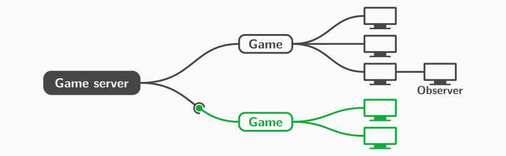

[](https://github.com/feberts/python-game-server/actions/workflows/test.yml)
[](https://github.com/feberts/python-game-server/actions/workflows/lint.yml)


# Multiplayer game server

A lightweight server and framework for turn-based multiplayer games.



Basic Python skills are sufficient to implement clients or add new games to the server.

## Overview

### Features

- a framework that allows new games to be added easily
- a uniform yet flexible API for all games
- multiple parallel game sessions
  - you can join a specific session
  - or auto-join the next non-full session
- an observer mode to watch another client play

### Designed for

- the development of turn-based multiplayer games such as board or card games
- programming courses in which students implement clients or new games

### Quick start

To try this project on your machine

1. start the server (`server/game_server.py`)
2. then run two clients (`client/tictactoe_client.py`) in separate shells

The only requirement is a regular Python installation.

### About this project

This server was developed for use in a university programming course, where students learn Python as their first programming language and work on projects in small groups. Both the framework and the API are designed so that the programming skills acquired during the first term are sufficient to implement new games and clients. However, the use of the server is not limited to educational scenarios.

## Operating the server

To run the server in a network, edit IP and port in the configuration file (`server/config.py`). TLS along with other settings can also be configured there. If you intend to run the server as a systemd service, you can use the provided unit file. Server and API are implemented in plain Python. Only modules from the standard library are used. This makes the server easy to handle.

Learn more in the [Wiki](https://github.com/feberts/python-game-server/wiki).

## Implementing clients

Module `game_server_api` provides an API for communicating with the server. It allows you to

- start or join a game session
- submit moves
- retrieve the game state
- passively observe another player
- restart a game within the current session
- enable TLS

Here is a short demo of the API usage:

```py
from game_server_api import GameServerAPI

game = GameServerAPI(server='127.0.0.1', port=4711, game='TicTacToe', players=2,
                     session='mygame') # pass 'auto' to auto-join a session (default)

my_id = game.join()    # start/join a session - each client is assigned an ID
game.move(position=5)  # perform a move - the function accepts keyword arguments (**kwargs)
state = game.state()   # returns a dictionary representing the game state, including
                       # the ID(s) of the current player(s)
```

The [API module](client/game_server_api.py) itself is documented in detail. You should also take a look at the demo clients and the [Wiki](https://github.com/feberts/python-game-server/wiki).

## Adding new games

Adding a new game is easy. All you have to do is derive from a base class and override its methods:

1. Create a new module in `server/games/`.
2. Implement a class that is derived from `AbstractGame`.
3. Override the base class's methods.
4. Add the new class to the list of games (`server/games_list.py`).

To make things even easier, you can use the [template](server/games/template.py) (`server/games/template.py`), which is structured like a tutorial.

No modifications to the API are required when adding new games. It was designed to be compatible with any game. The function to submit a move accepts keyword arguments (`**kwargs`). These are sent to the server, where they are passed to the corresponding function of the game class as a dictionary. The game state is also sent back as a dictionary. This allows for a maximum of flexibility.

## Observer mode

An observer will receive the same data as the observed player does when retrieving the game state. This can be useful in a number of ways:

- The observer mode can be used to split up the work in a team. One client could be implemented for the user interaction and another one to display the game board.
- In a similar way, it can be used as a substitute for multithreading, which is usually not taught in a beginner programming course. Suppose you want to implement a chat client that displays incoming messages continuously while allowing the user to write a new message at the same time. To achieve this, two threads of execution could be used. Alternatively, the observer mode can be used to implement separate clients for input and output.

## Contributing

Contributions are welcome. Feel free to create a pull request, open an issue or use the Discussions section.

## License

Copyright (C) 2025, 2026 Fabian Eberts. Licensed under the GPL version 3 (see LICENSE).
