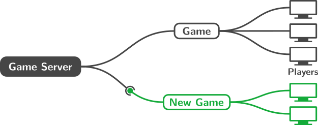

[](https://github.com/feberts/python-game-server/actions/workflows/test.yml)
[](https://github.com/feberts/python-game-server/actions/workflows/lint.yml)


[](https://github.com/feberts/python-game-server)

# Python Game Server

A lightweight server and framework for turn-based multiplayer games.

<p><picture>
  <source media="(prefers-color-scheme: dark)" srcset=".github/game_server_dark.svg">
  
</picture></p>

### Features
<!-- TODO -->
- Automatic matchmaking or explicit session joining
- A Flexible, game-agnostic API
- A framework that hides the complexity of multiplayer games from the programmer
- Adding new games by deriving from a base class and overriding a few methods
- Intelligent state updates to avoid polling
- Optional TLS support
- Only basic Python skills required

### Use cases

- Turn-based multiplayer games such as board or card games
- Programming courses where students implement clients or new games

### Quick start

To try this project on your machine:

1. Start the server (`server/game_server.py`)
2. Then run two clients (`client/tictactoe_client.py`)

The only requirement is a regular Python installation.

## Implementing clients

This is what a simple game loop might look like (see full example [here](client/tictactoe_client.py)):

```py
from game_server_api import GameServerAPI, IllegalMove

game = GameServerAPI(
    server='127.0.0.1',
    port=4711,
    game='TicTacToe',
    session='mygame', # use 'auto' for automatic matchmaking (default)
    players=2
)

my_id = game.join()
state = game.state()

while not state['gameover']:
    board = state['board']
    # print game board here ...

    if my_id in state['current']:
        pos = int(input('Your turn: '))
        try:
            game.move(position=pos) # **kwargs
        except IllegalMove as e:
            # something went wrong ...
    else:
        # opponent's turn ...

    state = game.state()
```

The [API module](client/game_server_api.py) allows you to:

- Start and join a game session
- Submit moves
- Retrieve the game state
- Restart a game within the current session

The [Wiki](https://github.com/feberts/python-game-server/wiki) includes an API reference and a page on implementing clients. Also have a look at the demo clients.

## Adding new games

Adding a new game is easy. You derive from a base class and override its methods:

1. Create a new module in `server/games/`
2. Implement a game class derived from `AbstractGame`
3. Override the required methods
4. Add the new class to the list of games (`server/games_list.py`)

You can also use the [template](server/games/template.py) (`server/games/template.py`).

### Flexible API

No API changes are needed when adding new games. It was designed to work with any game. The function to submit moves accepts arbitrary keyword arguments (`**kwargs`). These are sent to the server and passed to the game class as a dictionary. The game state is also returned as a dictionary. This allows for a maximum of flexibility.

### Abstraction

The framework hides the technical complexity of multiplayer games from the programmer. It takes care of networking, matchmaking, managing game sessions and handling client requests. This way, the programmer can focus on the game logic.

## Operating the server

To run the server in a network, edit IP and port in the configuration file (`server/config.py`). Other settings can also be adjusted there, including TLS. If you intend to run the server as a systemd service, you can use the provided unit file. Learn more in the [Wiki](https://github.com/feberts/python-game-server/wiki/Operating-the-server).

## About this project

This server was developed for a programming course, where students learn Python as their first programming language and work on projects in small groups. Both the framework and the API are designed so that basic programming skills are sufficient to implement games and clients. However, the use of the server is not limited to educational scenarios.

## Contributing

Contributions are welcome. Feel free to create a pull request, open an issue or use the Discussions section. A simple way to support the project is to **star the repository**.

## License

Copyright (C) 2025, 2026 Fabian Eberts. Licensed under the GPL version 3 (see LICENSE).

[Python Game Server — A lightweight server and framework for turn-based multiplayer games](https://github.com/feberts/python-game-server)
